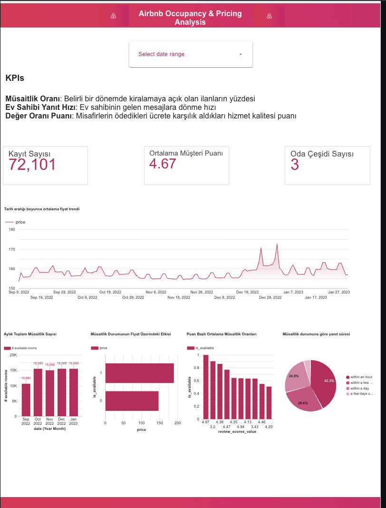
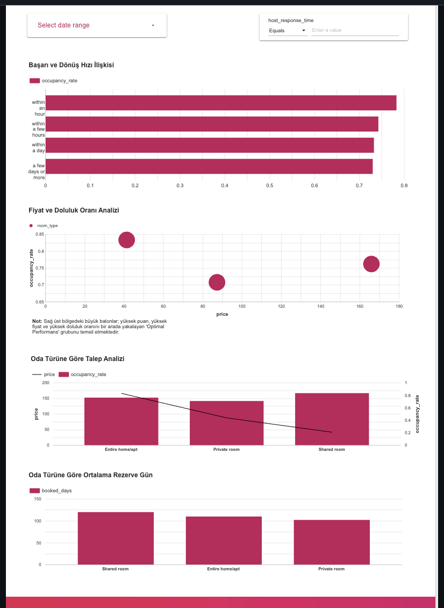

# 📊 Airbnb Occupancy & Pricing Analysis

Bu proje; Airbnb ilan verilerini derinlemesine inceleyerek doluluk oranlarını (occupancy rates), müşteri memnuniyetini (customer satisfaction) ve fiyatlandırma performansını etkileyen kritik faktörleri analiz etmek amacıyla geliştirilmiş bir İş Zekası (BI) ve veri analitiği projesidir.

Proje kapsamında, stratejik kararları desteklemek ve veri odaklı çıkarımlar sunmak amacıyla gelişmiş analitik panellerden oluşan çok sayfalı bir dashboard tasarlanmıştır.

---

## 📉 Dashboard Ekranları & Analitik Paneller

Projenin analitik çıktılarını ve veri görselleştirme adımlarını içeren ekran görüntüleri aşağıda listelenmiştir:

### 1. Genel Performans ve Fiyatlandırma Paneli (Sayfa 1)
Bölgelere göre doluluk oranlarının, ortalama fiyat dinamiklerinin ve müşteri memnuniyet skorlarının makro düzeyde izlendiği ana dashboard ekranı.

### 2. Detaylı Doluluk & Müşteri Deneyimi Analizi (Sayfa 2)
Fiyatlandırma stratejilerini optimize etmek, dönemsel trendleri yakalamak ve kullanıcı geri bildirimlerinin doluluk üzerindeki etkilerini incelemek için kurgulanmış detaylı analitik panel.

---

## 🛠️ Teknik Özellikler & Çözüm Yaklaşımı

* **Veri Analitiği:** Airbnb ilan ve performans verileri üzerinde veri temizleme, filtreleme ve metriklere göre gruplama süreçleri yürütülmüştür.
* **Görselleştirme ve BI:** Veri modelleri arasındaki ilişkiler kurgulanarak kullanıcı dostu, dinamik ve interaktif rapor ekranları tasarlanmıştır.
* **Odak Alanları:** Fiyat esnekliği analizi, doluluk oranlarını optimize eden faktörlerin tespiti ve müşteri memnuniyeti kırılımları.

---

## 📂 Proje Yapısı

* `dashboard/`: Analiz süreçlerini ve interaktif rapor tasarımlarını barındıran orijinal iş zekası dosyaları.
* `data/`: Analiz kapsamında işlenen ve görselleştirmelere kaynaklık eden Airbnb veri setleri.
* `screenshots/`: Projeye ait alternatif arayüz ve rapor ekran görüntüleri.
